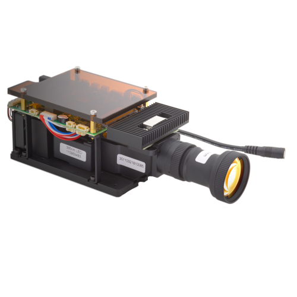
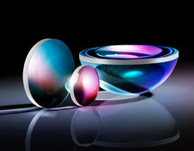

Mechanical Design & Manufacturing
====

Projector
#########

    
We use the `Wintech PRO1470 Projector <https://www.wintechdigital.com/PRO4710>`_ with an LED wavelength of **405nm** and a lens working distance of **114mm**.

                    **Cost: $1799.00**

Frame
#####
The frame is constructed out of 80/20 aluminum extrusion (20mm T-slot structural framing) and held together with T-nuts, joining plates and brackets. This is a cheap option which also lends itself well to adjustability.

Optics
######

    
    
Our system uses two `Edmund Optics lenses <https://www.edmundoptics.com/p/500mm-dia-x-1250mm-fl-uncoated-plano-convex-lens/5729/>`_ which are **50mm** in diameter with focal lengths of **125mm**. They are uncoated and plano-convex. According to `Knight Optical <https://www.knightoptical.com/news/the-value-of-condenser-lenses-in-projection-systems/>`_, placing two plano-convex lenses such that they both face convex-in creates a *condenser*. By placing the projector at the lens focal length, we are able to collimate the light with the first lens and then recreate the image at our desired location with the second in the series. The back focal length of these lenses is **118.39mm**, which closely matches our projector's lens working distance of **114mm**.

                    **Cost: $46.50 x 2 = $93.00**

Rotation Stage
##############
The rotation stage is a 3D-printed assembly which incorporates a gear train, linear stage, and vial holder. This is how the vial is held and rotated during the printing process, with built-in fine lateral adjustment for alignment purposes.

    Linear Stage
    ************
    
    This 3-D printed piece makes use of a dovetail joint plus a nut, bolt, and spring to make small adjustments to vial alignment rather than sliding the entire vertical extrusion back and forth.
    
    Vial Holder
    ***********
    The vial holder extends continuously downwards from the secondary gear and uses crush ribs to ensure a secure press-fit.
